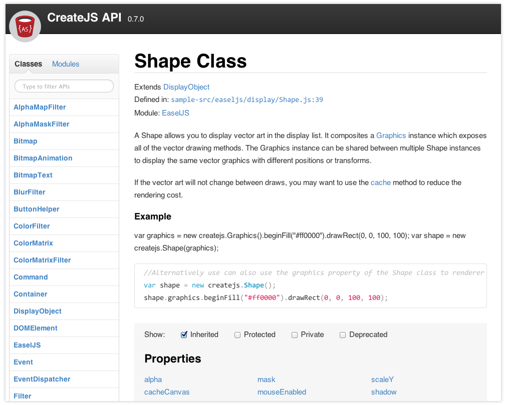

# YUIDoc Themes

The [YUIDoc](http://yui.github.io/yuidoc/) documentation generator is an amazing tool, but its default theme leaves much to be desired. The themes in this repository are intended to offer both visual and usability improvements.

This repository currently contains one theme - "friendly-theme" - for use with YUIDoc.

## "Friendly" Theme



## Installation Instructions

1. Clone this repository or [download it as a ZIP file](archive/master.zip).
2. Copy the "friendly-theme" directory to a convenient location. Feel free to delete all other files from the repository.

## How To Use (Mac instructions)

_These instructions assume you have already installed YUIDoc. If you haven't, follow the instructions on the [YUIDoc website](http://yui.github.io/yuidoc/) before continuing._

1. Open the Terminal app.
2. Navigate to the directory that contains contains the code for which you want to generate documentation. For example...

    ```
    cd ~/Projects/MyApp
    ```

3. Run the `yuidoc` command using the `-t` option to point to the custom theme you downloaded. For example...

    ```
    yuidoc scripts -t ~/Desktop/friendly-theme
    ```

The command above uses "friendly-theme" located on your Desktop to generate API docs for all files found within the "scripts" subdirectory. By default, YUIDoc saves the generated documentation into a folder named "out".

For more detail on YUIDoc configuration see the [command line options](http://yui.github.io/yuidoc/args/index.html#command-line) and [JSON configuration file](http://yui.github.io/yuidoc/args/index.html#json) documentation on the YUIDoc website.

## Report Bugs

If you encounter issues while using "theme-1" please [report it](issues)!